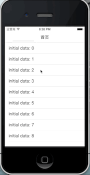
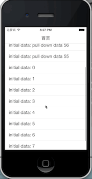

# How  to use ?

1. `#import "UIScrollView+RefreshControl.h"`
2. Add the refresh control to your UIScrollview objects
3. Using the control just like below methods





##  Fashion Style

TopRefreshControl
    
```objective-c
    typeof(self) weakSelf = self;
    [self.tableView addTopRefreshControlUsingBlock:^{
        dispatch_async(dispatch_get_global_queue(DISPATCH_QUEUE_PRIORITY_DEFAULT, 0), ^{
          // request for datas
    });
        dispatch_after(dispatch_time(DISPATCH_TIME_NOW, (int64_t)(0.7 * NSEC_PER_SEC)), dispatch_get_main_queue(), ^{
            [weakSelf.tableView topRefreshControlStopRefreshing];
            [weakSelf.tableView reloadData];
        });
    }];
``` 

BottomRefreshControl

```objective-c
    typeof(self) weakSelf = self;
    [self.tableView addBottomRefreshControlUsingBlock:^{        dispatch_async(dispatch_get_global_queue(DISPATCH_QUEUE_PRIORITY_DEFAULT, 0), ^{
          // request for datas
        });
        dispatch_after(dispatch_time(DISPATCH_TIME_NOW, (int64_t)(0.3 * NSEC_PER_SEC)), dispatch_get_main_queue(), ^{
            [weakSelf.tableView bottomRefreshControlStopRefreshing];
            [weakSelf.tableView reloadData];
        });
    }];
```

## Old Fashion Style

Pass refreshControlPullType `RefreshControlPullTypeOldFashion`

TopRefreshControl

```objective-c
addTopRefreshControlUsingBlock:refreshControlPullType:
```

BottomRefreshControl

```objective-c
addBottomRefreshControlUsingBlock:refreshControlPullType:
```