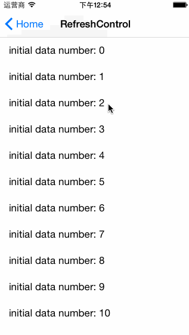
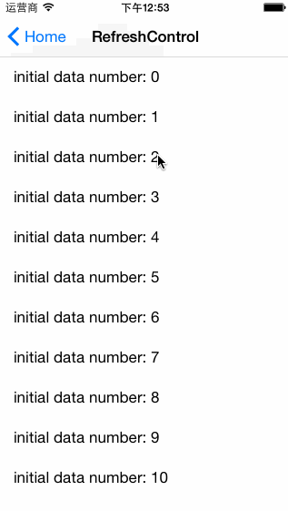
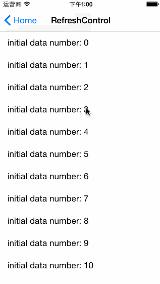
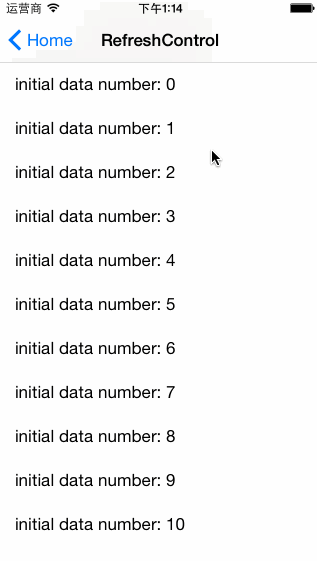
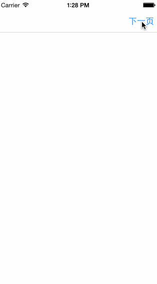
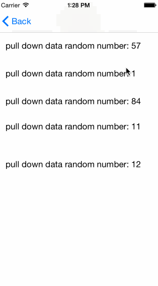
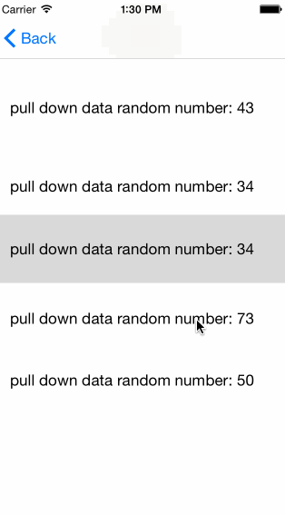
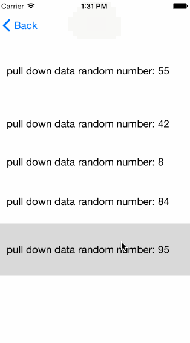
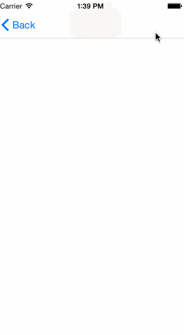

## How does it look like ?

<p align="left">
	&nbsp;
	&nbsp;
	&nbsp;
</p>
<p align="left">
	&nbsp;
	&nbsp;
	&nbsp;
</p>
<p align="left">
	&nbsp;
	&nbsp;
	&nbsp;
</p>
<p align="left">
	&nbsp;
	&nbsp;
</p>

## How  to use ?

### Podfile

`pod 'RefreshControl'`

### Project

 `#import "UIScrollView+RefreshControl.h"`

###  Sensitive Style

TopRefreshControl
    
```objective-c
    __weak typeof(self) weakSelf = self;
    [self.tableView addTopRefreshControlUsingBlock:^{
        dispatch_async(dispatch_get_global_queue(DISPATCH_QUEUE_PRIORITY_DEFAULT, 0), ^{
          // request for datas
    });
        dispatch_after(dispatch_time(DISPATCH_TIME_NOW, (int64_t)(0.7 * NSEC_PER_SEC)), dispatch_get_main_queue(), ^{
            [weakSelf.tableView reloadData];
            [weakSelf.tableView topRefreshControlStopRefreshing];
        });
    } refreshControlPullType:RefreshControlPullTypeInsensitive refreshControlStatusType:RefreshControlStatusTypeText];
``` 

**Attention**:  In call back block, you should reload data first, then stop `TopRefreshControl` animation, otherwise, your content focus will go to top. 

BottomRefreshControl

```objective-c
    __weak typeof(self) weakSelf = self;
    [self.tableView addBottomRefreshControlUsingBlock:^{        dispatch_async(dispatch_get_global_queue(DISPATCH_QUEUE_PRIORITY_DEFAULT, 0), ^{
          // request for datas
        });
        dispatch_after(dispatch_time(DISPATCH_TIME_NOW, (int64_t)(0.3 * NSEC_PER_SEC)), dispatch_get_main_queue(), ^{
            [weakSelf.tableView reloadData];
            [weakSelf.tableView bottomRefreshControlStopRefreshing];
        });
    } refreshControlPullType:RefreshControlPullTypeSensitive refreshControlStatusType:RefreshControlStatusTypeText];
```

**Attention**:  In call back block, you should always reload data first, then stop `BottomRefreshControl `animation, otherwise, your content bottom will always go to screen bottom.

### Initialize refreshing

```objective-c
    dispatch_after(dispatch_time(DISPATCH_TIME_NOW, (int64_t)(0.5 * NSEC_PER_SEC)), dispatch_get_main_queue(), ^{
        [self.tableView topRefreshControlStartInitializeRefreshing];
    });
```

### Insensitive Style & StatusType

```Objective-c
typedef NS_ENUM(NSInteger, RefreshControlPullType) {
    RefreshControlPullTypeSensitive,
    RefreshControlPullTypeInsensitive
};

typedef NS_ENUM(NSInteger, RefreshControlStatusType) {
    RefreshControlStatusTypeTextAndArrow,
    RefreshControlStatusTypeText,
    RefreshControlStatusTypeArrow
};
```

Pass refreshControlPullType `RefreshControlPullTypeInsensitive`

TopRefreshControl

```objective-c
addTopRefreshControlUsingBlock:refreshControlPullType:refreshControlStatusType
```

BottomRefreshControl

```objective-c
addBottomRefreshControlUsingBlock:refreshControlPullType:refreshControlStatusType
```

### By the way

You can change the status text and color, loading animation circle color and arrow color.

```objective-c
@property (nonatomic, strong) NSString *topRefreshControlPullToRefreshingText;
@property (nonatomic, strong) NSString *topRefreshControlPullReleaseToRefreshingText;

@property (nonatomic, strong) NSString *bottomRefreshControlPullToRefreshingText;
@property (nonatomic, strong) NSString *bottomRefreshControlPullReleaseToRefreshingText;

@property (nonatomic, strong) UIColor *statusTextColor;
@property (nonatomic, strong) UIColor *loadingCircleColor;
@property (nonatomic, strong) UIColor *arrowColor;
```

You can set refresh failure status text

```Objective-c
topRefreshControlRefreshFailureWithHintText:
bottomRefreshControlRefreshFailureWithHintText:
```

You can handle touch event by you self

```Objective-c
addTouchUpInsideEventForTopRefreshControlUsingBlock:
addTouchUpInsideEventForBottomRefreshControlUsingBlock:
```

If you don't handle this event, we will refresh again when you touch RefreshControl or pull again. Of course, after you handle this event, you wanna refresh again, call flow message or pull

```Objective-c
topRefreshControlResumeRefreshing
bottomRefreshControlResumeRefreshing
```


